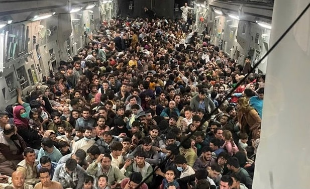

```{r loadinglibraries, echo=FALSE}
library(readr)
library(tidyverse)
library(lubridate)
library(kableExtra)
library(sparkline)
library(DT)
library(formattable)
```

```{r loadingdata, echo=FALSE}
Afghan_data <- read_csv(here::here(("data/WHO-COVID-19-global-data.csv"))) %>% 
  select(Date_reported, Country, New_cases, New_deaths) %>% 
  filter(Country == "Afghanistan") %>%
  mutate(Year = year(Date_reported),
         Month= month(Date_reported)) %>% 
  filter(Year == "2021") %>% 
  select(-c(Date_reported))
```

# Introduction and Backgroud

Afghanistan is a country located in the south-central Asia. The country has been under a continuous conflict for 40 years and is again at war in 2021 itself. Before this it has been struggling with drought, hunger and along with it, the coronavirus disease (COVID-19) as well (Ghai, 2021).

```{r image, echo = F, out.width = '70%', fig.align='center'}

```

## The Afghanistan Crises

In June 2021, Taliban (Islamic Emirate of Afghanistan) tried to take over Afghanistan and this came into limelight by mid July'21. This lead to a war-like scenario and included a series of events that brought a lot of people in great crowds. Two of such events were burning homes and other public properly, leaving people on the streets together and in August 2021, as the rescue planes were sent by The USA, huge crowds were observed at the airports.

```{r global, echo = F, out.width = '70%', fig.align='center'}

```

Below, the analysis is focused on the COVID-19 numbers of 2021 (cases and deaths) and its relation with the on-going crises.

# Data Description

## Data Source

- The data set used in this blog has been extracted from [World Health Organization-WHO](https://covid19.who.int/info/). Which was in-turn collected by WHO via different sources. 

- Till 21 March'20, WHO collected these numbers via official ministries of health websites, social media and through official communications under the International Health Regulations-IHR, 2005. From 22 March'20, WHO collected data through WHO dashboards and counts declared at the WHO headquarters regularly (WHO Coronavirus (COVID-19) Dashboard, 2021).

## Variable description

The data set used for the analysis contains the data from January'21 to August'21. The variables used in the analysis are given below with their description and variable type: 
```{r identifyingtypes, include=FALSE}
str(Afghan_data)
```

```{r desc, echo=FALSE}
Desc <- data.frame(Variables = names(Afghan_data),
                          Description = c("Country - Afghanistan",
                                          "New COVID-19 cases, calculated by subtracting 'previous total cases before the date' from 'current total cases till date'",
                                          "New COVID-19 deaths, calculated by subtracting 'previous total deaths before the date' from 'current total deaths till date'",
                                          "Year of reporting to WHO",
                                          "Month of reporting to WHO"
                                        
                                          ),
                   Type = c("character",
                            "numeric",
                            "numeric",
                            "numeric",
                            "numeric"))

knitr::kable(Desc,
             caption = "Description of Variables used") %>% 
  kable_styling(bootstrap_options = c("striped", "hover")) %>% 
  row_spec(1:5, color = "black", background = "#DAC8AB")
```

## Summary Statistics

The table below displays the minimum value, maximum value, mean and SD (Standard deviation) of the numeric variables (other than year and month).

```{r, echo= FALSE,results='asis'}
variables <- c("New Cases", "New deaths")
min <- c(min(Afghan_data$New_cases), 
           min(Afghan_data$New_deaths))
max <- c(max(Afghan_data$New_cases), 
           max(Afghan_data$New_deaths))
mean <- c(round(mean(Afghan_data$New_cases),2), 
           round(mean(Afghan_data$New_deaths),2))
sd <-c(round(sd(Afghan_data$New_cases),2), 
           round(sd(Afghan_data$New_deaths),2))
description <- data.frame(variables, min, max, mean, sd)
DT::datatable(description, options = list(pageLength = 4), caption = "Table 2: Variable Statistics") 
```

Here from Table 2, an interesting observation is found out that the mean and SD of new cases is way more than the mean and SD of new deaths. 

# Analysis

## Analysis Communicaion

Afghanistan has been under a war in the later months of 2021 till now (i.e. till Aug'21). The goal of the analysis is to find out if the crises has had an impact on the COVID-19 surge in the country as well.

### COVID-19 statistics from Jan'21-Aug'21

The table below, shows:

- The months of 2021 i.e. '1 to 8' representing 'January to August' respectively.

- Total no. of deaths(sum) in the corresponding month.

- Total no. of cases(sum) in the corresponding month.

- A bar plot representing a trend of deaths in the corresponding month.

```{r analysis, echo =FALSE}
TO <- Afghan_data %>% 
  group_by(Month) %>% 
  summarise(
            Sum_cases = sum(New_cases),
            Sum_deaths = sum(New_deaths),
            Deaths = spk_chr(New_deaths, type = "bar")) %>% 
 datatable(escape = FALSE,
            options = list(fnDrawCallback = htmlwidgets::JS('function(){HTMLWidgets.staticRender();}')), caption = "Table 3: Trend of cases and deaths in 2021") %>% 
  spk_add_deps() %>% formatStyle("Sum_cases", backgroundColor="#F16C54  ") %>% formatStyle("Sum_deaths", backgroundColor="#74BD68  ")
TO
```
It is observed that:

In January and April, total deaths and cases are comparatively higher when compared to February and March. But in May we observe that the cases have rapidly increased whose impact (deaths) is seen in June, and further June having a high increase of cases and gradual decrease by August.

Here, from table 3 itself, the statistics for latest 4 months is highlighted below.

```{r part2, echo=FALSE}
TT <- Afghan_data %>% 
  group_by(Month) %>% 
  summarise(New_cases = sum(New_cases),
            New_deaths = sum(New_deaths)) %>% 
  filter(Month %in% c("5","6","7","8")) %>% 
  as.data.frame() %>%
  formattable(list(area(col = 2:3) ~ color_tile("#686AE4", "#F3C003")))
TT
```

Clearly a high in numbers for cases and deaths is observed in June and July in Afghanistan and a sudden decrease in August.

# Conclusion

It is evident by observing the numbers throughout the year, that something unusual has happened in Afghanistan from June that has lead to a sudden hike in cases and deaths simultaneously. And this particular event definitely involves crowd gatherings, as that is one of the major causes for the spread of COVID-19, leading to high cases. And also,close contacts in gatherings causes severe transfer of the infection which is lethal leading to more deaths.

Hence, the crises/war in Afghanistan has caused an impact on COVID-19. As the crises comes to an end in August, we see that the cases and deaths have also dropped significantly from July to August.

# References

[1] Covid19.who.int. 2021. WHO Coronavirus (COVID-19) Dashboard. [online] Available at: <https://covid19.who.int/info/> [Accessed 1 September 2021].

[2] Garrett Grolemund, Hadley Wickham (2011). Dates and Times Made Easy
with lubridate. Journal of Statistical Software, 40(3), 1-25. URL
https://www.jstatsoft.org/v40/i03/.

[3] GitHub: Where the world builds software. (2021). Retrieved 2 June 2021, from https://github.com/

[4] Ghai, R., 2021. Taliban take-over: Afghanistan already battling drought, hunger, COVID-19. DownToEarth, [online]. URL: https://www.downtoearth.org.in/news/governance/taliban-take-over-afghanistan-already-battling-drought-hunger-covid-19-78475 [Accessed 1 September 2021].

[5] Hadley Wickham and Jim Hester (2021). readr: Read Rectangular Text
Data. R package version 2.0.0. https://CRAN.R-project.org/package=readr

[6] Hao Zhu (2021). kableExtra: Construct Complex Table with 'kable' and Pipe
Syntax. R package version 1.3.4. https://CRAN.R-project.org/package=kableExtra

[7] Kun Ren and Kenton Russell (2021). formattable: Create 'Formattable'
Data Structures. R package version 0.2.1.
https://CRAN.R-project.org/package=formattable

[8] Ramnath Vaidyanathan, Kent Russell and Gareth Watts (2016). sparkline:
'jQuery' Sparkline 'htmlwidget'. R package version 2.0.
https://CRAN.R-project.org/package=sparkline

[9] RStudio Team (2020). RStudio: Integrated Development for R. RStudio, PBC, Boston, MA URL http://www.rstudio.com/.

[10] Tanaka, E., 2021. ETC5523: Communicating with Data, Monash University.

[11] Wickham et al., (2019). Welcome to the tidyverse. Journal of Open
Source Software, 4(43), 1686, https://doi.org/10.21105/joss.01686
  
[12] Yihui Xie, Joe Cheng and Xianying Tan (2021). DT: A Wrapper of the
JavaScript Library 'DataTables'. R package version 0.18.
https://CRAN.R-project.org/package=DT


